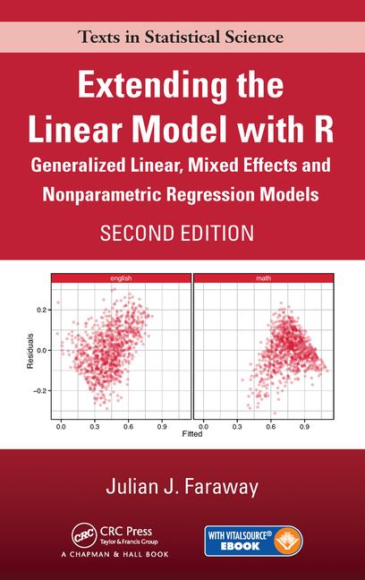
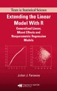

# Extending the Linear Model with R

## Julian Faraway

### Second Edition

- The book is published by [CRC press](https://www.crcpress.com/Extending-the-Linear-Model-with-R-Generalized-Linear-Mixed-Effects-and/Faraway/9781498720960)
- Install the [faraway](https://cloud.r-project.org/web/packages/faraway/index.html) package in R to access the datasets
- The [Errata](errata2.md).
- The [R commands](scripts2/index.md)  used in text.
- [STAN implementations](../stan/index.html) of the linear mixed models in the book are also available.
- [INLA implementations](../inla/index.html) of the linear mixed models in the book are also available.

### First Edition

- The book is published by [CRC press](http://www.crcpress.com/product/isbn/9781584884248).
- [Preface and Table of Contents](prefelm.pdf)
- The book refers to many datasets that can be found in the
  "faraway" package that needs to be added to R.
  Windows and Macintosh users will find it most convenient to select
  the "Install packages from CRAN"
  option under the "Package" menu while running R, and then choose "faraway"
  from the list of packages. A source version of the package can be obtained
  from the [R website](http://www.r-project.org).
- The [data](../book/jfdata.zip) from the *faraway* package
  in  ASCII format. These are provided for the convenience of users
  of statistical software other than R. Users of R should install
  the *faraway* package.
- The [R commands](scripts/index.md)  used in text.
- The [Errata](errata.md).
- The `lme4` package, used to  fit models with random effects and used extensively in Chapters 8 and 9, has
  undergone substantial changes since the publication of the book. Please read about these [changes](../mixchange/index.html)
  along with some suggested solutions. (last updated April 2015).

