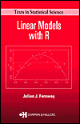

# Linear Models with R

## by Julian Faraway

The book refers to many datasets that can be found in the *faraway* package that 
you will need to install in R. You can do this using the "Tools->Install Packages"
menu in Rstudio or the "Packages and Data" menu in the R GUI. Alternatively, you
can install the [development version](https://github.com/julianfaraway/faraway)

Second Edition
--------------

Published 1st July 2014 and available from [CRC Press](http://www.crcpress.com/product/isbn/9781439887332).

-   [Table of Contents and R scripts](toc2.md)
-   [Preface](preface2.md)
-   [Errata](errata2.md)
-   [Mostly equivalent Python scripts](python/) - see also [Linear Models with Python](https://julianfaraway.github.io/LMP/)

First Edition
-------------

-   [Preface](preface.md)
-   [Zip file of R commands](RscriptsEd1.zip) used in text.
-   [Errata](errata.html)

