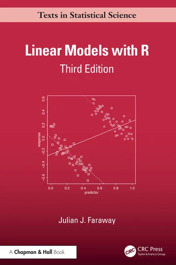

# Linear Models with R

## by Julian Faraway

## R package

The book refers to many datasets that can be found in the *faraway* package that 
you will need to install in R. You can do this using the "Tools->Install Packages"
menu in Rstudio or the "Packages and Data" menu in the R GUI. Alternatively, you
can install the [development version](https://github.com/julianfaraway/faraway)

Third Edition
-------------

Published 27th February 2025 and available from [Routledge](http://www.routledge.com/9781032583983)

-   [Table of Contents and R scripts](toc3.md)
-   [Preface](preface3.md)

Second Edition
--------------

Published 1st July 2014 and available from [Routledge](https://eur01.safelinks.protection.outlook.com/?url=https%3A%2F%2Fwww.routledge.com%2FLinear-Models-with-R%2FFaraway%2Fp%2Fbook%2F9781439887332%3Futm_source%3Dauthor%26utm_medium%3Dshared_link%26utm_campaign%3DB043141_jm1_5ll_6rm_t081_1al_julianfarawayauthorshare&data=05%7C01%7Cjjf23%40bath.ac.uk%7C5229b0dc8d564222c10108db31fa6e3f%7C377e3d224ea1422db0ad8fcc89406b9e%7C0%7C0%7C638158723883874621%7CUnknown%7CTWFpbGZsb3d8eyJWIjoiMC4wLjAwMDAiLCJQIjoiV2luMzIiLCJBTiI6Ik1haWwiLCJXVCI6Mn0%3D%7C3000%7C%7C%7C&sdata=ULDqi49DeFSpsBEC3dCOJPMmNTO9K%2FkCdU3I%2FnIBhzI%3D&reserved=0)

-   [Table of Contents and R scripts](toc2.md)
-   [Preface](preface2.md)
-   [Errata](errata2.md)
-   [Mostly equivalent Python scripts](python/) - see also [Linear Models with Python](https://julianfaraway.github.io/LMP/)

First Edition
-------------

-   [Preface](preface.md)
-   [Zip file of R commands](RscriptsEd1.zip) used in text.
-   [Errata](errata.html)

